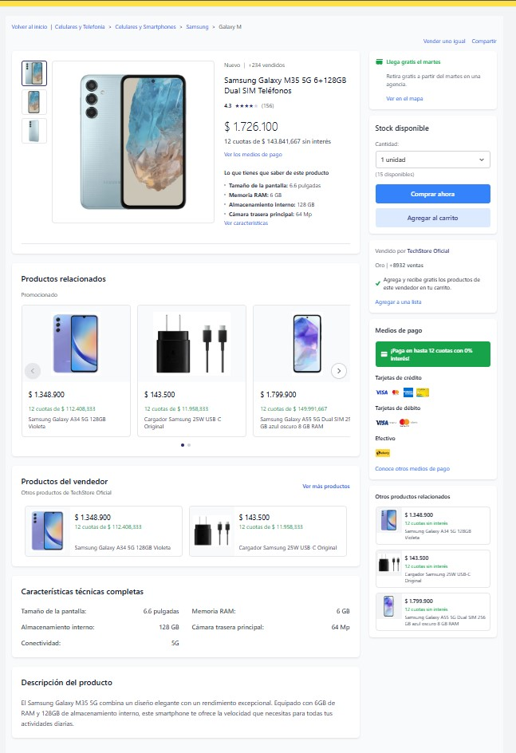

# MercadoLibre Clone

Este proyecto es un clon full-stack de MercadoLibre que implementa una página de detalle de productos con API RESTful de soporte.



## 🚀 Tech Stack

### Backend
- **FastAPI** - Framework web moderno y rápido para Python
- **Pydantic** - Validación de datos y serialización
- **Uvicorn** - Servidor ASGI de alto rendimiento
- **Pytest** - Framework de testing con >80% coverage

### Frontend
- **React 18** - Biblioteca de interfaz de usuario
- **Vite** - Herramienta de build y desarrollo rápida
- **Tailwind CSS** - Framework de CSS utility-first
- **React Router v7** - Enrutamiento con code splitting
- **Axios** - Cliente HTTP para API calls
- **Vitest** - Framework de testing unitario

## 📁 Estructura del Proyecto

```
mercadolibre-clone/
├── backend/                 # API FastAPI
│   ├── app/
│   │   ├── main.py         # Aplicación principal con middleware
│   │   ├── models.py       # Modelos Pydantic de datos
│   │   ├── routers/        # Endpoints organizados por recurso
│   │   │   └── products.py # CRUD de productos
│   │   └── data/           # Almacenamiento JSON (simula BD)
│   │       └── products.json
│   ├── tests/              # Suite de tests con pytest
│   ├── requirements.txt    # Dependencias Python
│   └── run_backend.py      # Script de inicio del servidor
│
├── frontend/               # Aplicación React + Vite
│   ├── src/
│   │   ├── components/     # Componentes React reutilizables
│   │   │   ├── ProductDetail.jsx    # Página principal de producto
│   │   │   ├── ProductImages.jsx    # Galería de imágenes
│   │   │   ├── ProductList.jsx      # Lista de productos
│   │   │   ├── PaymentMethods.jsx   # Métodos de pago
│   │   │   └── SellerInfo.jsx       # Info del vendedor
│   │   ├── pages/          # Componentes de página/ruta
│   │   ├── services/       # Integración con API
│   │   │   └── api.js      # Cliente Axios configurado
│   │   └── hooks/          # Custom React hooks
│   ├── tests/              # Tests con Vitest y React Testing Library
│   └── package.json        # Dependencias y scripts npm
├── documentacion.md       # Documento técnico de diseño
└── README.md              # Este archivo
```

## 🛠️ Instalación y Configuración

### Requisitos Previos

- **Python 3.8+** (recomendado Python 3.12)
- **Node.js 16+** (recomendado Node.js 18+)
- **npm** o **yarn**

### 1. Clonar el Repositorio

```bash
git clone <repository-url>
cd mercadolibre-clone
```

### 2. Configurar Backend

```bash
cd backend

# Crear y activar entorno virtual
python3 -m venv venv
source venv/bin/activate  # Linux/Mac
# venv\Scripts\activate   # Windows

# Instalar dependencias
pip install -r requirements.txt
```

### 3. Configurar Frontend

```bash
cd frontend
npm install
```

## 🚀 Ejecución

### Desarrollo Local

Necesitas **dos terminales** ejecutándose simultáneamente:

#### Terminal 1 - Backend (Puerto 8000)
```bash
cd backend
source venv/bin/activate
python run_backend.py
```

#### Terminal 2 - Frontend (Puerto 5173)
```bash
cd frontend
npm run dev
```

### Acceso a la Aplicación

- **Frontend**: http://localhost:5173
- **API Documentation**: http://localhost:8000/docs
- **API Health Check**: http://localhost:8000/health

## 📊 API Endpoints

| Método | Endpoint | Descripción |
|--------|----------|-------------|
| `GET` | `/health` | Health check del servidor |
| `GET` | `/api/v1/products` | Lista productos con paginación |
| `GET` | `/api/v1/products/{id}` | Detalle específico de producto |
| `GET` | `/api/v1/products/{id}/related` | Productos relacionados |
| `GET` | `/api/v1/payment-methods` | Métodos de pago disponibles |

### Ejemplo de Uso de API

```bash
# Listar productos (con paginación)
curl "http://localhost:8000/api/v1/products?limit=10&offset=0"

# Obtener producto específico
curl "http://localhost:8000/api/v1/products/1001"

# Buscar productos
curl "http://localhost:8000/api/v1/products?search=smartphone"
```

## 🧪 Testing

### Backend Tests (>80% Coverage)

```bash
cd backend
source venv/bin/activate

# Ejecutar tests
pytest

# Con reporte de coverage
pytest --cov=app --cov-report=term-missing

# Generar reporte HTML
pytest --cov=app --cov-report=html
# Ver en: htmlcov/index.html
```

### Frontend Tests

```bash
cd frontend

# Ejecutar tests
npm run test

# Con coverage
npm run test:coverage
```

## 📦 Build de Producción

### Frontend

```bash
cd frontend
npm run build    # Genera archivos en dist/
npm run preview  # Preview del build
```

### Backend

```bash
cd backend
# Para producción con múltiples workers
pip install gunicorn
gunicorn app.main:app -w 4 -k uvicorn.workers.UvicornWorker --bind 0.0.0.0:8000
```

## 🎨 Características Principales

### Frontend
- ✅ **Diseño Responsive** - Mobile-first con Tailwind CSS
- ✅ **Galería de Imágenes** - Thumbnails navegables con preview
- ✅ **Productos Relacionados** - Carrusel responsive sin librerías externas  
- ✅ **Información del Vendedor** - Rating, reputación y datos de contacto
- ✅ **Métodos de Pago** - Visualización de opciones de pago
- ✅ **Búsqueda** - Filtrado en tiempo real
- ✅ **Manejo de Estados** - Loading, error y estados vacíos
- ✅ **React Router** - Navegación con lazy loading

### Backend
- ✅ **API RESTful** - Endpoints bien estructurados con FastAPI
- ✅ **Validación de Datos** - Modelos Pydantic para type safety
- ✅ **Manejo de Errores** - Respuestas consistentes con context
- ✅ **Documentación Auto** - Swagger UI generada automáticamente
- ✅ **CORS Configurado** - Para desarrollo frontend
- ✅ **Paginación** - Para optimización de performance
- ✅ **Testing Integral** - Suite completa con coverage >80%

## 🔧 Configuración Avanzada

### Variables de Entorno

**Backend** (`.env` en `/backend/`):
```env
PORT=8000
HOST=0.0.0.0
DEBUG=True
```

**Frontend** (`.env` en `/frontend/`):
```env
VITE_API_BASE_URL=http://localhost:8000/api/v1
```

### Linting y Calidad

```bash
# Frontend
cd frontend
npm run lint     # ESLint con reglas React
npm run build    # Incluye verificaciones de build

# Backend - Linting manual recomendado con:
cd backend
pip install black flake8
black .          # Formateo de código
flake8 .         # Linting de código
```

## 🐛 Troubleshooting

### Puerto en Uso
```bash
# Encontrar proceso usando puerto
lsof -i :8000
kill -9 <PID>
```

### Reinstalar Dependencias
```bash
# Backend
cd backend && pip install -r requirements.txt

# Frontend  
cd frontend && rm -rf node_modules package-lock.json && npm install
```

### CORS Issues
El backend acepta requests desde:
- `http://localhost:5173` (Vite dev)
- `http://127.0.0.1:5173`
- `http://localhost:5174` (Vite preview)

## 🏗️ Arquitectura

El proyecto sigue una **arquitectura Cliente-Servidor** con separación clara de responsabilidades:

- **Frontend (React)**: Maneja la presentación, interacciones del usuario y estado local
- **Backend (FastAPI)**: Expone API RESTful, validación de datos y lógica de negocio  
- **Datos (JSON)**: Almacenamiento simple en archivos para prototipado rápido

### Decisiones de Diseño

- **Sin Base de Datos**: Uso de archivos JSON para simplificar el setup y deployment
- **API-First**: Backend diseñado como servicio independiente y reutilizable
- **Component-Based**: Frontend organizado en componentes pequeños y reutilizables
- **Mobile-First**: Diseño responsive que prioriza la experiencia móvil

## 📄 Licencia

Este proyecto fue desarrollado como prueba técnica y está disponible para fines educativos y de demostración.

## 👨‍💻 Desarrollo

Para información técnica detallada sobre decisiones de arquitectura, desafíos enfrentados y soluciones implementadas, ver [DOCUMENTACION.md](./DOCUMENTACION.md).

---

**¡El proyecto está listo para funcionar siguiendo las instrucciones de instalación!**

Accede a **http://localhost:5173** para ver la aplicación en acción.


**Elabaorado por:** 
David Espinosa Dicelis
